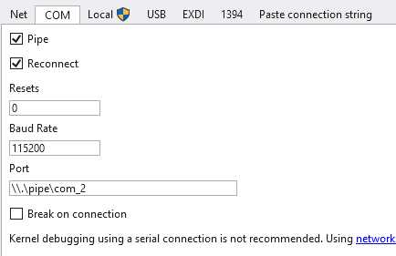

# Skalpeù

Homemade EDR

## Structure

- Driver
- Static analysor
- Remote injector (inject DLL into binaries)

## Notes

host setup:
- VS Studio 2022 -> C++ dev type + spectre mitigation x86/64 indiv packet
- Windows SDK Toolkit from microsoft.com
- Visual Studio -> add Windows Driver Kit from indiv packet

guest setup:
- Win11 VM with all security protections disabled
- Device Security -> Core isolation -> all 3 -> OFF

kernel debugging setup:
- Serial port on the VM (with named pipe ```\\.\pipe\com_2```, this end is the server, the other end is an application)
- guest: System configuration -> Debug on ```COM2``` & ```Baud Rate``` to ```115200```
- host: Windbg + Secure Boot off + ```bcdedit /debug on``` & ```bcdedit /dbgsettings serial debugport:2 baudrate:115200```
And WinDBG as admin -> attach to kernel and:  


## Sources

- https://www.youtube.com/watch?v=n463QJ4cjsU
- https://blog.whiteflag.io/blog/from-windows-drivers-to-a-almost-fully-working-edr/